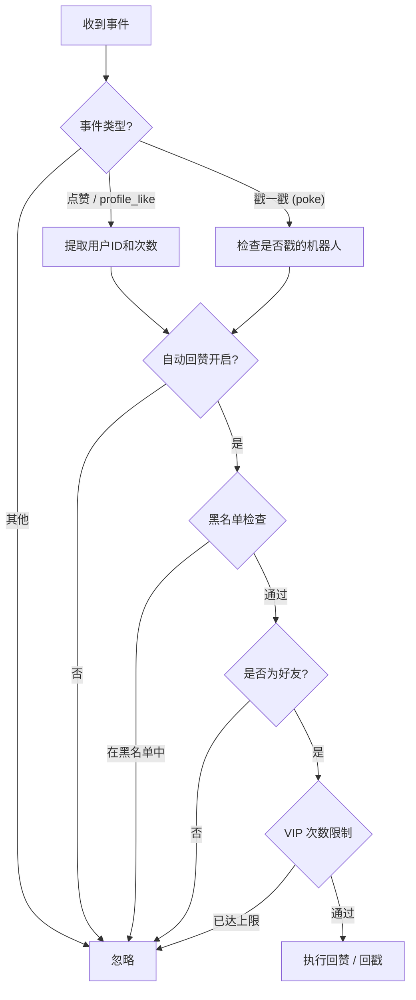

# napcat-plugin-auto-to-like

> 一个基于 [NapCat](https://github.com/NapNeko/NapCatQQ) 的 QQ 自动回赞插件，收到点赞 / 戳一戳自动回赞回戳，还支持定时主动给指定好友点赞。

## ✨ 功能特性

- 🔄 **自动回赞** — 收到好友点赞后自动回赞相同次数
- 👆 **自动回戳** — 收到群内戳一戳后自动回戳
- 👤 **定时赞指定用户** — 定时自动给指定用户列表点赞，可配置间隔和次数
- 🚫 **黑名单过滤** — 设置黑名单用户，不对其自动回赞
- 👑 **VIP 次数限制** — 可限制 VIP 用户每日被回赞次数
- 🤝 **好友验证** — 仅回赞好友列表中的用户
- 🌐 **WebUI 管理面板** — 通过 NapCat WebUI 可视化管理配置
- 🔧 **NapCat 配置面板** — 支持 NapCat 原生配置 Schema，直接在 WebUI 中修改配置

## 📦 安装

### 方式一：从 Release 下载（推荐）

1. 前往 [Releases](https://github.com/ChaceQC/napcat-plugin-auto-to-like/releases) 页面下载最新的 zip 包
2. 解压到 NapCat 的 `plugins` 目录

### 方式二：手动构建

```bash
git clone https://github.com/ChaceQC/napcat-plugin-auto-to-like.git
cd napcat-plugin-auto-to-like
pnpm install
pnpm run build
```

将 `dist/` 目录内容复制到 NapCat 的 `plugins` 目录即可。

## ⚙️ 配置说明

安装后在 NapCat WebUI 的插件配置面板中即可可视化配置，所有参数均支持热更新。

| 配置项 | 类型 | 默认值 | 说明 |
|--------|------|--------|------|
| `enabled` | 布尔 | `true` | 插件全局开关 |
| `debug` | 布尔 | `false` | 调试模式，启用后输出详细日志 |
| `autoLikeEnabled` | 布尔 | `true` | 是否启用自动回赞 |
| `blacklist` | 数组 | `[]` | 黑名单用户 ID 列表 |
| `vipLikeLimit` | 数字 | `10` | VIP 用户每日回赞次数上限 |
| `autoLikeSomeoneEnabled` | 布尔 | `false` | 是否启用定时赞指定用户 |
| `autoLikeUsers` | 数组 | `[]` | 需要定时点赞的用户 ID 列表 |
| `autoLikeInterval` | 数字 | `1440` | 自动赞间隔（分钟） |
| `autoLikeTimes` | 数字 | `10` | 每次自动赞的次数 |

## 🔄 工作流程



## � 开发指南

### 环境要求

- Node.js 18+
- pnpm

### 开发命令

```bash
# 安装依赖
pnpm install

# 完整构建（后端 + WebUI 前端）
pnpm run build

# 仅构建 WebUI 前端
pnpm run build:webui

# WebUI 前端开发服务器
pnpm run dev:webui

# 开发模式（watch + 自动部署热重载）
pnpm run dev

# 一键部署
pnpm run deploy

# 类型检查
pnpm run typecheck
```

> **热重载**：需要在 NapCat 端安装 `napcat-plugin-debug` 插件。`pnpm run dev` 会 watch 后端文件变化，自动重新构建并部署。

### 项目结构

```
napcat-plugin-auto-to-like/
├── src/
│   ├── index.ts              # 插件入口，生命周期函数
│   ├── config.ts             # 配置定义和 WebUI Schema
│   ├── types.ts              # TypeScript 类型定义
│   ├── core/
│   │   └── state.ts          # 全局状态管理单例
│   ├── handlers/
│   │   ├── like-handler.ts   # 点赞/戳一戳事件处理
│   │   └── message-handler.ts # 消息处理器
│   ├── services/
│   │   └── api-service.ts    # WebUI API 路由
│   └── webui/                # React SPA 前端
├── .github/
│   └── workflows/
│       ├── release.yml        # CI/CD 自动构建发布
│       └── update-index.yml   # 自动更新插件索引
├── package.json
├── tsconfig.json
├── vite.config.ts
└── README.md
```

## 🚀 CI/CD

推送 `v*` 格式的 tag 即可自动构建发布，并自动向 [napcat-plugin-index](https://github.com/NapNeko/napcat-plugin-index) 提交 PR 更新插件索引。

```bash
git tag v1.0.0
git push origin v1.0.0
```

## 📄 许可证

MIT License
